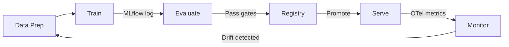
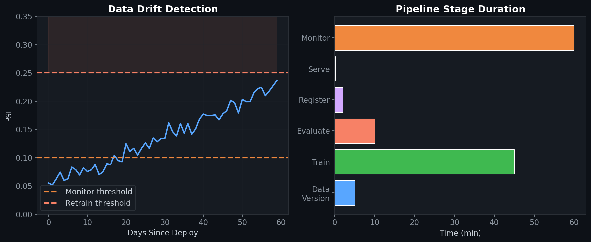

# 🏭 Enterprise ML Pipeline (Dataiku + MLflow)

> End-to-end MLOps pipeline for enterprise model lifecycle: training, evaluation, versioning, deployment, and monitoring with Dataiku and MLflow.

## 🎯 Overview

Production ML requires more than model training. This pipeline covers the full lifecycle: data versioning, experiment tracking, quality gates, model registry, serving, and drift monitoring. Built around Dataiku for orchestration and MLflow for tracking.

## 🧮 Mathematical Foundation

### Data Drift Detection (KL Divergence)
$$D_{\text{KL}}(P_{\text{new}} \| P_{\text{train}}) = \sum_x P_{\text{new}}(x) \log \frac{P_{\text{new}}(x)}{P_{\text{train}}(x)}$$

Alert when $D_{\text{KL}} > \tau$ — model may need retraining.

### Population Stability Index
$$\text{PSI} = \sum_{i} (p_i^{\text{new}} - p_i^{\text{train}}) \ln \frac{p_i^{\text{new}}}{p_i^{\text{train}}}$$

| PSI | Interpretation |
|---|---|
| < 0.1 | No significant shift |
| 0.1 - 0.25 | Moderate shift — monitor |
| > 0.25 | Significant shift — retrain |

### Quality Gates
$$\text{Promote}(m) \iff \forall c \in \text{checks}: c(m) = \text{Pass}$$

Checks: accuracy ≥ threshold, latency ≤ SLA, bias ≤ limit, no regressions.

### A/B Testing (Sequential Analysis)
$$\Lambda_n = \prod_{i=1}^{n} \frac{p(x_i | H_1)}{p(x_i | H_0)}, \quad \text{Stop when } \Lambda_n \geq A \text{ or } \Lambda_n \leq B$$

## 📊 Pipeline Metrics

| Stage | Tool | SLA |
|---|---|---|
| Data versioning | DVC / Dataiku | < 5 min sync |
| Training | MLflow + Unsloth | Logged per run |
| Evaluation | lm-eval-harness + custom | Quality gates enforced |
| Registry | MLflow Model Registry | Staging → Production |
| Serving | vLLM / KServe | p99 < 200ms |
| Monitoring | OTel + Prometheus | Drift alert < 1 hr |

## License
MIT

## 📸 Visual Tour

---
